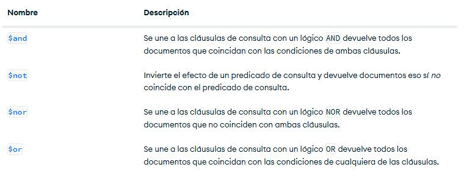

# Crud y consultas en MongoDB
Solo se crea si contiene por lo menos una coleccion
*use bd1*

## Como crear una coleccion
use db1
db.createCollection("Empleado")

## Mostrar las colecciones
show collections

## Insertar un documento


json
 db.Alumnos.insertOne(
  {
    _id: ObjectId('679d2ab6078c2dd4adcb0ce2'),
    nombre: 'Soyla',
    apellido1: 'Vaca',
    ciudad: 'San Miguel de las Piedras'
  }
)


## Insercion
json
db.Alumnos.insertOne
(
 { 
    nombre: "Joaquin",
    apellido1: "Dorian",
    apellido2: "Guerrero",
    edad: 15,
    aficiones: ["Cerveza","Hueva","Canavis"]
 }
)

## Insercion de documentos mas complejos con documentos anidados 
json
db.Alumnos.insertOne
(
 {
    nombre: "oscar",
    apellido1: "salinas",
    apellido2: "escobar",
    edad: 20,
    estudios: [
            "Kinder","Primaria","Secundaria","Preparatoria"
              ],
    experiencia: {
    lenguaje: "SQL",
    sbd: "SQL Server",
    aniosExp: 3
        }
 }
)


# Practica 1

## Cargar datos
[Libros.json](./data/libros.json)


## busquedas. condiciones simples de igualdad. metodo find()
```json 
db.libros.find({})
```
2. mostrar todos los documentos que sean de la editorial Biblio
```json
bd1> db.libros.find({editorial:'Biblio'})
```
3. mostrar que todos los librois con presio sea 25
``` json 
bd1> db.libros.find({precio : 25})

```
4. seleccionar todos los libros donde el titulo sea json para todos 
``` json 
bd1> db.libros.find({titulo:'JSON para todos'})
```
##operadores de comparacion 
[operadores de comparacion](https://www.mongodb.com/docs/manual/reference/operator/query/)


1. mostrar todos lo documentos ddonde el precio sea mayor a 25
```json 
bd1> db.libros.find(
... {
... precio : {$gt: 25 }
... }
... )
```
2. mostrar los documentos donde precio sea 25 
``` json
bd1> db.libros.find( { precio: { $eq: 25 } } )
```
3. mostrar los documentos cuya cantidad sea meno a 25
```json 
bd1> db.libros.find( { cantidad: { $lt: 5 } } )
```
4.mostrar los documentos que pertenescan a la editoria biblio o planeta 
```json 
bd1> db.libros.find( { editorial: { $in: ['Biblio' , 'Planeta' ] }} )
```

5. mostrar todos los documentos que cuesten 20 o 25 
```json 
db.libros.find( { precio: { $in: [20 , 25 ] }} )
```
6. mostrar todos los documentos que cuesten  no cuesten 20 o 25
```json 
db.libros.find( { precio: { $nin: [20 , 25 ] }} )

``` 
7. mostrar el primer libro que cueste 20 o 25 
``` json
db.libros.findOne( { precio:{ $in:[20 ,25]} } )
```

## operadores logicos  



### operador AND

Dos posibles oipciones de AND 
1. la simple mediante condiciones separadas por comas

***sintaxis*** 

db.coleccion.find({condicion1, condicion2}) -> con asume que es una ***AND***

2. usando el operador $and
***sintaxis***

db.coleccion.find($and:[{condicion1},{condicion2}]})

### ejercicios 

1. mostrar todos los aquellos libros que cuesten mas de 25 y cuya cantidad sea inferior a 15
***fORMA SIMPLE***
```json
db.libros.find( {precio:{$gt : 25}, cantidad: {$lt:15}})
```
***operador  AND***
db.libros.find( { $and:[{precio:{$gt:25}},{cantidad:{$lt:15}}]})

## mostrar todos aquellos libros  que cuesten mas de 25 o cuya cantidad  sea inferior a 15 
``` json 
 db.libros.find( { $or: [ { precio: { $gt: 25 } }, { cantidad:{$lt: 10 }} ] } )
```

### AND Y OR Combinadas 
1. mostrar los libros de la editorial Biblio con precio mayor a 40  o libros de  la editorial Planeta con precio mayor a 30  
``` json 

db.libros.find (
{
  $or:[
      {$and:[{editorial:'Blibio'},{precio:{$gt:40}}]},
      {$and: [{editorial:{$eq:'Planeta'}},{precio:{$gt:30}}]}
  ]
}
)
```
*** sintaxis *** 
db.coleccion.find(filtro, columnas)
db.libros.find({}, {titulo:1})


1. seleccionar todos los documentos mostrando el titulo y la editorial 
```json 
bd1> db.libros.find({}, {titulo:1})
bd1> db.libros.find({}, {titulo:1 , editorial: 1, _id:0})
```
2. seleccionar todos los documentos de la editorial Planeta, mostrando solamente el titulo y la editorial 
```json 
bd1> db.libros.find({Titulo:Planeta}, {titulo:1 , editorial: 1, _id:0})
```
## Operador exists (Peromite SABER SI UN CAMPO SE ENCUENTRA O NO EN UN)
```json
db.libros.InsertOne({_id:10, titulo: 'Mongo entornos graficos', editorial: 'Tierra', precio: 125})
```

1.Mostrar los docs que no contengan el campo cantidad

```json
db.libros.find({ cantidad:{$exists:false}})
```


#### Operador Type (Permite preguntar si un determinado campo corresponde con un tipo) 

[Operador Type](https://www.mongodb.com/docs/manual/reference/operator/query/type/#mongodb-query-op.-type)

```jason
db.libros.find({precio:{$type:1}})

db.libros.find({precio:{$type:16}})

db.insert.insertOne({
  _id:11,
  titulo:"IA",
  editorial:"Terra",
  precio:125.4,
  cantidad:20
})
```

#### Operador Type (Permite preguntar si un determinado campo corresponde con un tipo) 

[Operador Type](https://www.mongodb.com/docs/manual/reference/operator/query/type/#mongodb-query-op.-type)

1. Mostrar todos los docs donde el precio sean Dosposibles

json
db.libros.find({precio:{$type:1}})
db.libros.find({precio:{$type:16}})


db.libros.insertOne({
  _id:11,
  titulo:'IA',
  editorial:'Terra',
  precio:125.4,
  cantidad:20
})

2. Seleccionar los docs donde el precio sea de tipo entero
db.libros.find({precio:{$type:1}}, {_id:0})

db.libros.insertMany([
 {
    _id: 12,
    titulo: 'IA',
    editorial: 'Terra',
  precio: 125,
  cantidad: 20
  },
  {
    _id: 13,
    titulo: 'Python para todos',
    editorial: 2001,
    precio: 200,
  cantidad: 30
  }]
  )

db.libros.find({precio:{$type:1}}, {_id:0, cantidad:0})


3. Seleccionar todos los docs donde la editorial sea String

db.libros.find({editorial:{$type:2}})

db.libros.find({editorial:{$type:'string'}})


-En local:
comando: 
 mongoimport --db curso --collection empleados --file empleados.json


 ### comandos importantes 
 1. updateOne -> Modificar un un solo documento
 2. updateMany -> Modifica multiples documentos 
 3. replaceOne -> Sustituir el contenido completo de un documento

Tiene el segundo formato : 
```json 
db.collection.updateOne(
{filtro},)
```
[Operadores ]


db.libros.updateMany(
  {precio:{$gt:100}},
  {$set:{precio:150}}
)