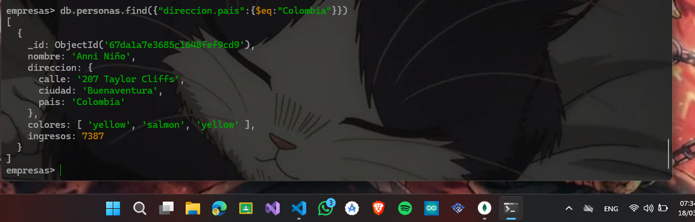
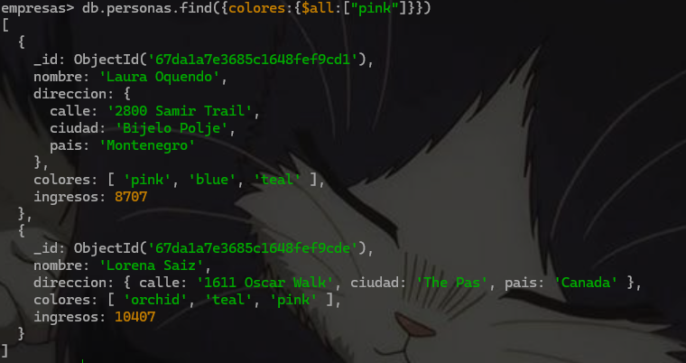
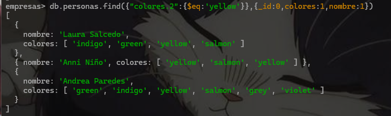
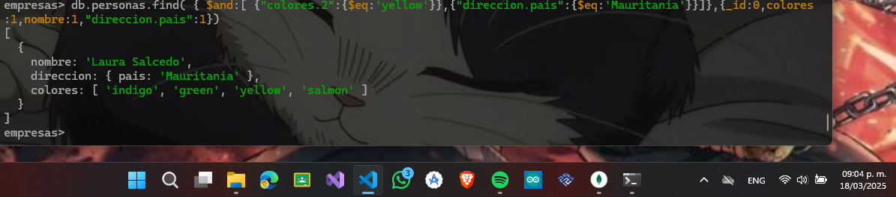
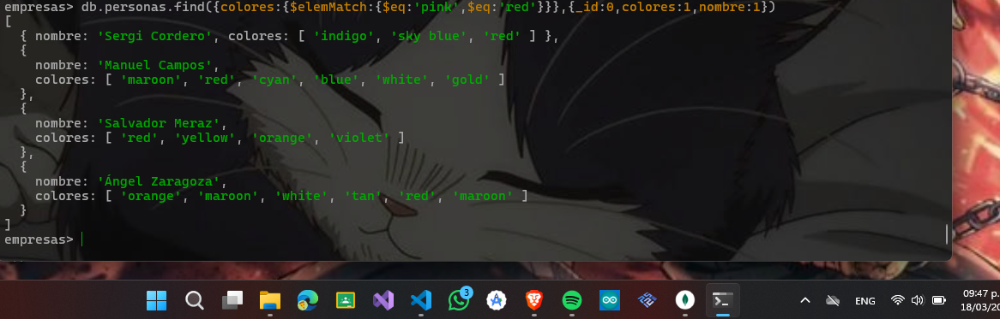

# Arrays y documentos anidados

1. Para hacer esta práctica vamos a cargar unos datos ficticios de empresas.

2. Tienes un fichero denominado “personas.json”

3. Debes poner el resultado de las consultas en cada apartado

- Buscar las personas que vivan en Colombia
```json 
 db.personas.find({"direccion.pais":{$eq:"Colombia"}})
```
## resultado  consulta 



- Personas a las que le guste el color rosa
```json
 db.personas.find({colores:{$all:["pink"]}})
```


- Personas cuyo tercer color preferido sea el amarillo (yellow). Recuerda que los arrays comienzan por Cero. Deben salir 3
```json 
db.personas.find({"colores.2":{$eq:'yellow'}},{_id:0,colores:1,nombre:1})
```


- Personas cuyo tercer color preferido sea el amarillo (yellow) y que vivan en Mauritania (debe salir uno)
```json
db.personas.find( { $and:[ {"colores.2":{$eq:'yellow'}},{"direccion.pais":{$eq:'Mauritania'}}]},{_id:0,colores:1,nombre:1,"direccion.pais":1})
```


- Usando el operador $all averiguar las personas que les gusta el plata (silver) y el salmon (salmon)
``` json 
 db.personas.find({colores:{$all:['silver','salmon']}})
```


- Con el operador $elemMatch, averigua las personas que les guste el rosa (Pink) o el rojo (red)
```json 
db.personas.find({colores:{$elemMatch:{$eq:'pink',$eq:'red'}}},{_id:0,colores:1,nombre:1})
```

