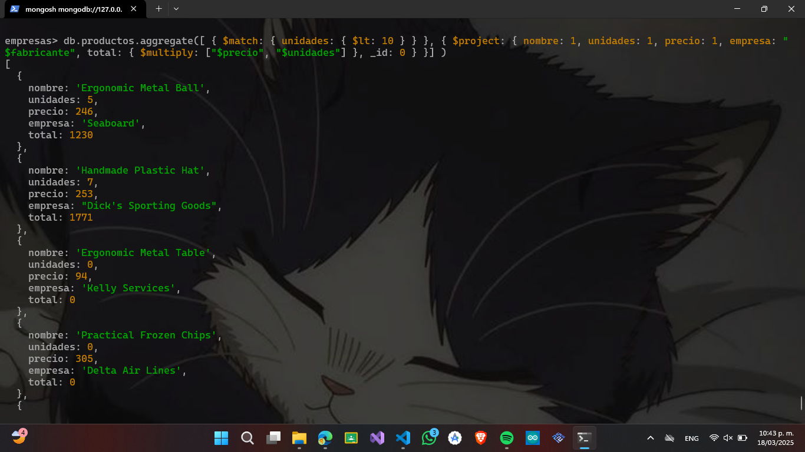
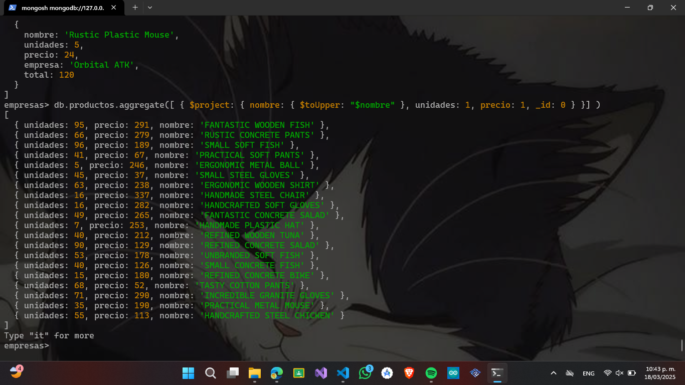
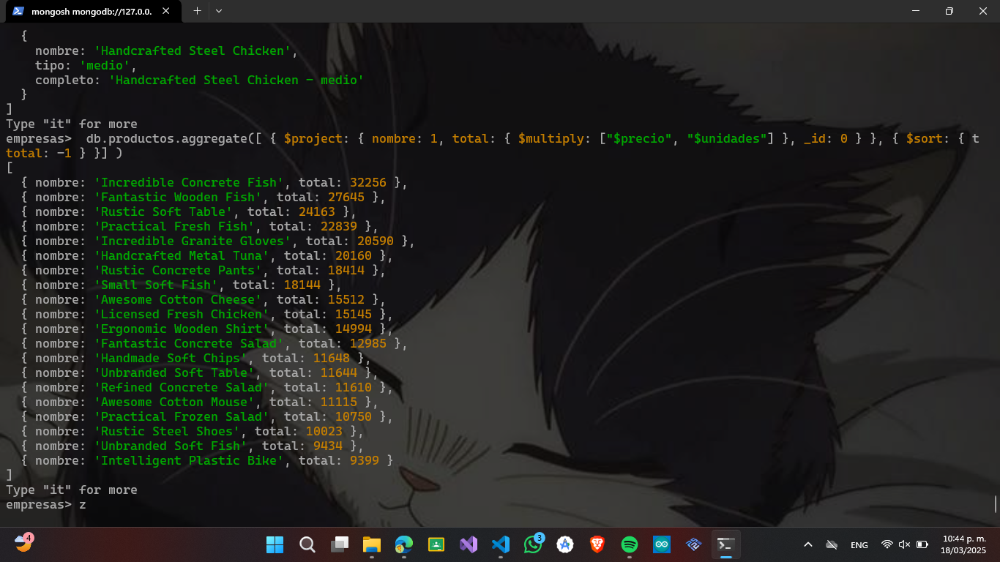
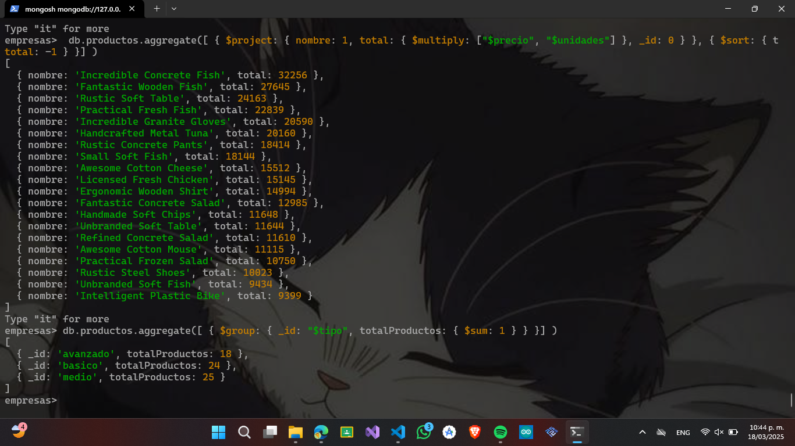
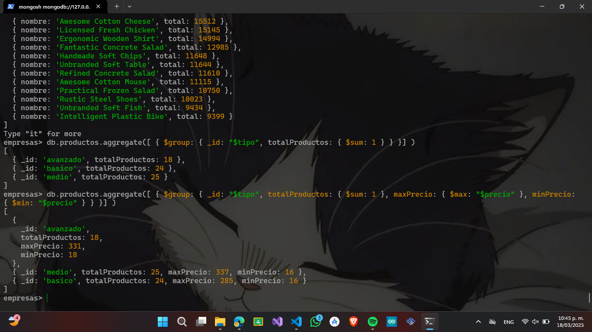
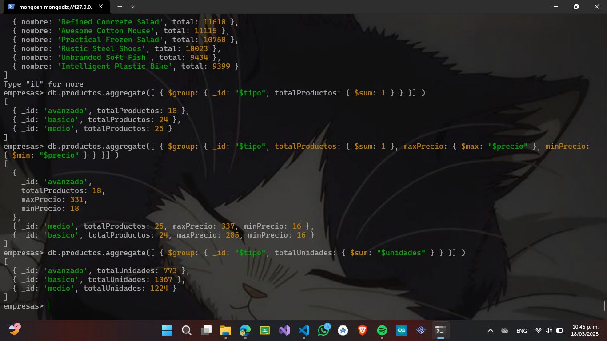
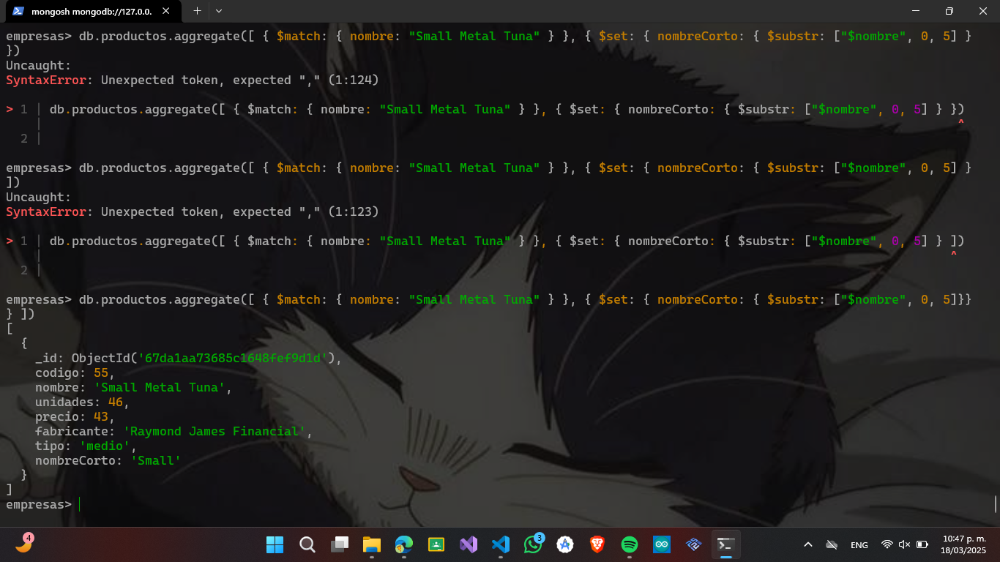
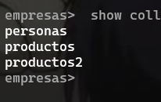
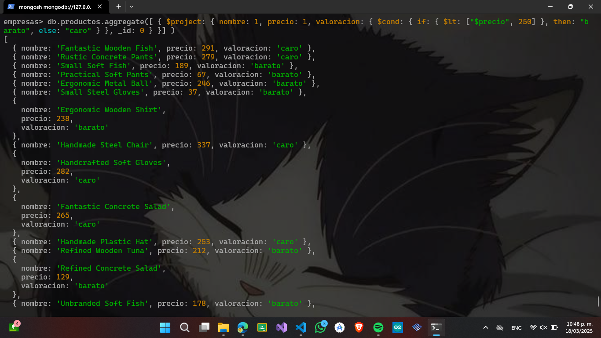

# Agregaciones

1. Para hacer esta práctica vamos a cargar unos datos ficticios de empresas.
2. Tienes un fichero denominado “productos.json”
3. Debes poner el resultado de las consultas en cada apartado

- Cuenta los productos de tipo “medio”, usando un método básico
```JSON 
db.productos.find({ tipo: "medio" }).count()
```


- Indicar con un distinct, las empresas (fabricantes) que hay en la colección
```JSON 
db.productos.distinct("fabricante")
db.productos.distinct("fabricante").length
```


- Usando aggregate, visualizar los productos que tengan más de 80 unidades
```JSON 
db.productos.aggregate([ { $match: { unidades: { $gt: 80 } } }])

```

- Con $project visualizar solo el nombre, unidades y precio de los productos que tengan menos de 10 unidades
```JSON 
db.productos.aggregate([ { $match: { unidades: { $lt: 10 } } }, { $project: { nombre: 1, unidades: 1, precio: 1, _id: 0 } }] )
```


- Con $project ponemos el fabricante pero le cambiamos el nombre por “empresa”. Usamos el mismo comando anterior
```JSON 
db.productos.aggregate([ { $match: { unidades: { $lt: 10 } } }, { $project: { nombre: 1, unidades: 1, precio: 1, empresa: "$fabricante", _id: 0 } }] )
```


- Añadir a la consulta anterior un campo calculado que se llame total y que multiplique precio por unidades.
```JSON 
db.productos.aggregate([ { $match: { unidades: { $lt: 10 } } }, { $project: { nombre: 1, unidades: 1, precio: 1, empresa: "$fabricante", total: { $multiply: ["$precio", "$unidades"] }, _id: 0 } }] )
```


- Hacer que el nombre salga en mayúsculas con el operador $toUpper
```JSON 
empresas> db.productos.aggregate([ { $project: { nombre: { $toUpper: "$nombre" }, unidades: 1, precio: 1, _id: 0 } }] )
```


- Añadir un campo calculado que ponga el nombre del producto y el tipo concatenado con el operador $concat. Le llamamos al campo “completo”
```JSON 
db.productos.aggregate([ { $project: { nombre: 1, tipo: 1, completo: { $concat: ["$nombre", " - ", "$tipo"] }, _id: 0 } }] 
```


- Ordena el resultado por el campo “total”
```JSON 
 db.productos.aggregate([ { $project: { nombre: 1, total: { $multiply: ["$precio", "$unidades"] }, _id: 0 } }, { $sort: { total: -1 } }] )
```


- Haciendo una nueva consulta, averiguar el numero de productos por tipo de producto
```JSON 
db.productos.aggregate([ { $group: { _id: "$tipo", totalProductos: { $sum: 1 } } }] )
```


- Añadir el valor mayor y el menor
```JSON 
db.productos.aggregate([ { $group: { _id: "$tipo", totalProductos: { $sum: 1 }, maxPrecio: { $max: "$precio" }, minPrecio: { $min: "$precio" } } }] )
```


- Añade el total de unidades por cada tipo
```JSON 
db.productos.aggregate([ { $group: { _id: "$tipo", totalUnidades: { $sum: "$unidades" } } }] )
```


- Con el operador $set y el operador “$substr” visualiza todos los datos del producto "Small Metal Tuna" y los primeros 5 caracteres del nombre.
```JSON 
db.productos.aggregate([ { $match: { nombre: "Small Metal Tuna" } }, { $set: { nombreCorto: { $substr: ["$nombre", 0, 5]}} } ])
```


- Creamos una salida que tenga el nombre del articulo y el total (precio por unidades) y lo guardamos en una colección denominada productos2
```JSON 
 db.productos.aggregate([ { $project: { nombre: 1, total: { $multiply: ["$precio", "$unidades"] }, _id: 0 } }, { $out: "productos2" }] )
```


- Comprobamos que se ha creado
```JSON 
 show collections
```


- Hacemos un find para comprobar el resultado
```JSON 
db.productos2.find({})
```


- Usando $cond y $project vamos a visualizar el nombre del producto, el precio y un campo llamado valoración que ponga “barato” si el precio es menor de 
250 y caro si es mayor o igual

```JSON 
db.productos.aggregate([ { $project: { nombre: 1, precio: 1, valoracion: { $cond: { if: { $lt: ["$precio", 250] }, then: "barato", else: "caro" } }, _id: 0 } }] )
```
